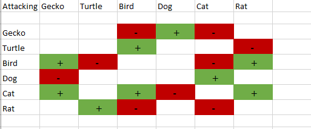

# AIGameGroup

<h2>Getting Started</h2>

Hey guys, here we've got the game happening. 

Things you need to do to get set up:
* Install Unity https://unity3d.com/get-unity/download
* Clone the repository to your computer (see this page) https://help.github.com/articles/fetching-a-remote/
  * Basically you just need to do "git clone https://github.com/*USERNAME/REPOSITORY*.git"
  * Another great Git tutorial is http://rogerdudler.github.io/git-guide/
* Open Unity, and open an existing project. Navigate to the AIGame folder which you've cloned to your computer in the previous step
* Press the big-ass triangle Play button at the top of the screen to run what we've got so far

<h1>Week 4: </h1>
<h2>Pet Warrior Types Strength/Weaknesses Chart</h2>

<h3>Pets Concept art Chart</h3>

<h1>Week 3: </h1>
We nail down all of the game mechanics we're going to work on and distribute the work load. Lucia will be working on the art and audio, Chris will be working on programming the AI of the NPCs and Battle System, Megan will work on putting the user interfaces and dialogue aspects in the game. We also finally decide to call the game Pet Warrior

<h4>Pet Stats</h4>

A list of stats that will affect the outcome of a battle

<h1>Week 2: </h1>
We met up and discussed what type of adventure the player might go on in our game. We want it to have a sense of humor. Megan was put in charge of writing up a script and we all would pitch our opinions and ideas as she created it. 
*script here* 

We have a basic level design and we begin to think about how many levels and rooms our player will be able to move around in.
<h4>Sample level</h4>

<h1>Week 1: </h1>
We all met up to discuss what type of game we wanted to create. We decided on a "Pokemon" type RPG. We want the player to collect pets and fight them in turn based combat. Each with their own unique abilities, the player must accomplish some task set before them and travel through several stages with their pets, using them in battles along the way. The name was not decided yet, and a lot of the details still needed to be discussed. We knew it was going to be a 2D pixel art game created in the Unity game engine and we created some basic assets as a prototype for what it might look like.
<h4>Player Prototype sprite</h4>

<h4>NPC Prototype sprite</h4>

